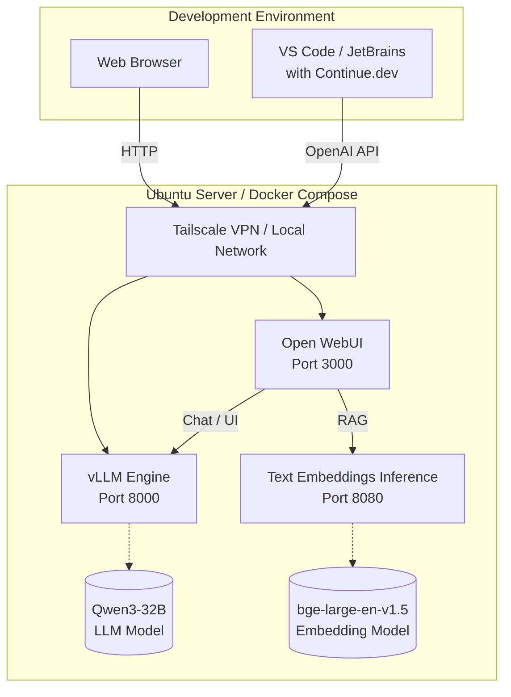

# AI Inference Server for Software Development

A production-ready, self-hosted AI inference platform specifically designed for software development. This project orchestrates local, open-source models using vLLM for high-throughput coding tasks, alongside Text Embeddings Inference (TEI) for semantic search, all wrapped in a Docker Compose environment. 

It provides an OpenAI-compatible API that can be consumed directly by IDE extensions (like [Continue.dev](https://continue.dev/)) and a rich browser frontend ([Open WebUI](https://openwebui.com/)).

---

## 🚀 Features

* **Completely Local & Private**: No data is sent to OpenAI, Anthropic, or any third party.
* **High Performance**: Powered by **vLLM**, optimized for high-end NVIDIA GPUs (e.g., RTX A6000) to maximize throughput and concurrency.
* **State-of-the-art Coding Models**: Setup is tailored for models like **Qwen3-Coder 30B**, balancing coding capability and hardware constraints.
* **Built-in Embeddings**: Includes a local embedding engine (`BAAI/bge-large-en-v1.5`) via Hugging Face TEI for intelligent RAG (Retrieval-Augmented Generation) and repository search.
* **Ready for IDEs**: Exposes an OpenAI-compatible API out of the box, perfect for VS Code and JetBrains integration.
* **Dockerized Infrastructure**: Simple, reproducible, and easy to upgrade using Docker Compose.

---

## 🏗️ Architecture



---

## 📋 Prerequisites

Before starting, ensure your host machine (e.g., Ubuntu Server) has the following installed:

1. **NVIDIA Drivers** and a capable NVIDIA GPU (24GB+ VRAM recommended for 30B parameter models).
2. **Docker** and the **Docker Compose** plugin.
3. **NVIDIA Container Toolkit** (Allows Docker to utilize the GPU).
4. *(Optional)* **Tailscale** for secure remote access without exposing ports to the public internet.

---

## 🛠️ Quick Start

### 1. Clone & Configure

Clone the repository and prepare your environment:

```bash
git clone <your-repo-url> ai-inference-server
cd ai-inference-server
```

Open the `.env` file and insert your Hugging Face token. This is required to download gated models (like some Llama or Qwen variants):
```env
HUGGING_FACE_HUB_TOKEN=hf_your_token_here
```

### 2. Prepare the Environment & Download Models

Run the setup scripts to install necessary dependencies on the host, create directories, and download the weights.
```bash
bash scripts/setup.sh
```

If you only need to download or update the models, you can run the download script directly:
```bash
bash scripts/download_models.sh
```

### 3. Start the Server

Once the models are downloaded to the `./models` directory, start the services:

```bash
docker compose up -d
```

You can monitor the logs to ensure everything starts correctly:
```bash
docker compose logs -f vllm
```

---

## ⚙️ Configuration (`.env`)

You can toggle which model variant is loaded by commenting/uncommenting the corresponding block in your `.env` file:

- **Option 1: Base Model (INT8 bitsandbytes)**
  - Slower inference, but easy to run if you've already downloaded the raw weights.
- **Option 2: AWQ Model (Recommended)**
  - Considerably faster on modern GPUs (like the RTX A6000) using AWQ quantization.

*Note: If you change the model in `.env`, be sure to restart the vLLM container (`docker compose down vllm && docker compose up -d vllm`).*

---

## 🔌 IDE Integration (Continue.dev)

To use your self-hosted AI directly in your code editor, install the **Continue** extension in VS Code or JetBrains.

Add the following to your Continue configuration (`config.json`):

```json
{
  "models": [
    {
      "title": "Local Qwen3-Coder",
      "provider": "openai",
      "model": "Qwen3-32B",
      "apiKey": "sk-local-vllm",
      "apiBase": "http://<YOUR_SERVER_IP>:8000/v1"
    }
  ],
  "embeddingsProvider": {
    "provider": "openai",
    "model": "BAAI/bge-large-en-v1.5",
    "apiKey": "sk-local-vllm",
    "apiBase": "http://<YOUR_SERVER_IP>:8080/v1"
  }
}
```
*Replace `<YOUR_SERVER_IP>` with the Tailscale IP or local network IP of your Ubuntu server.*

---

## 📂 Project Structure

```text
ai-server/
├── .env                  # Environment variables and configuration
├── docker-compose.yml    # Docker services definition
├── README.md             # This file
├── configs/              # Configuration overrides (if any)
├── models/               # Bind-mounted directory for downloaded LLM/Embedding weights
├── open-webui/           # Persistent volume data for Open WebUI
├── scripts/              # Setup and model download scripts
└── vllm/                 # Persistent volume data for vLLM
```

---

## 🚑 Troubleshooting

- **Out of Memory (OOM) Errors:** If `vllm` crashes immediately with an OOM error, lower the `--max-model-len` parameter in `docker-compose.yml` (e.g., from `32768` to `16384` or `8192`). 
- **Input Token Limit Exceeded:** If you get an error stating your prompt exceeds the maximum context length, increase `--max-model-len` in `docker-compose.yml`. (Just remember to ensure you have enough VRAM!).
- **GPU not detected:** Ensure you have installed the `nvidia-container-toolkit` and restarted the Docker daemon (`sudo systemctl restart docker`).
